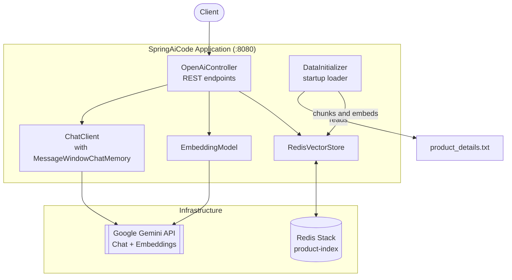
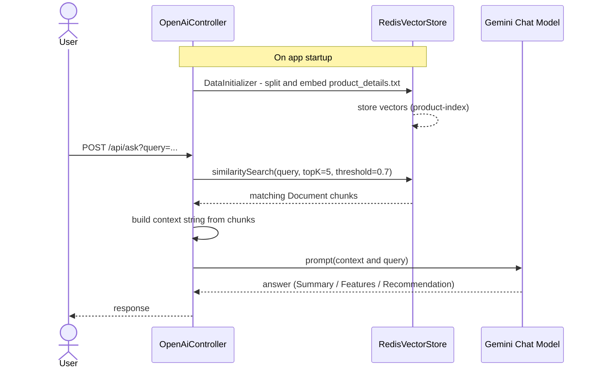

# Spring AI + Redis RAG


A Spring Boot service that uses **Redis as a vector store** to power Retrieval-Augmented Generation (RAG) over a small product catalog, built on **Spring AI**. On top of RAG, it exposes plain Gemini chat, raw embedding generation, and cosine-similarity endpoints — useful as a reference for wiring Spring AI's abstractions (`ChatClient`, `EmbeddingModel`, `VectorStore`) directly to Redis.

---

## Table of Contents

1. [Architecture](#architecture)
2. [How RAG Works Here](#how-rag-works-here)
3. [API Endpoints](#api-endpoints)
4. [Tech Stack](#tech-stack)
7. [Project Structure](#project-structure)

---

## Architecture

A single Spring Boot application, backed by Redis for vector storage and chat memory, and Google Gemini for the LLM and embedding model.



## How RAG Works Here

`/api/ask` is the RAG endpoint. On startup, `DataInitializer` chunks `product_details.txt` with `TokenTextSplitter` and embeds each chunk into Redis under the `product-index`. At query time, the controller retrieves the most relevant chunks and stuffs them into the prompt before calling the LLM.



## API Endpoints

| Method | Path | Description |
|---|---|---|
| `GET` | `/api/{message}` | Simple chat completion for the given message |
| `POST` | `/api/recommend?type=&year=&lang=` | Recommends a movie based on type, year, and language |
| `POST` | `/api/embedding?text=` | Returns the embedding vector for the given text |
| `POST` | `/api/similarity?text1=&text2=` | Returns cosine similarity (%) between two texts |
| `POST` | `/api/product?text=` | Raw vector similarity search against the product index |
| `POST` | `/api/ask?query=` | RAG: retrieves relevant product chunks (top-5, similarity ≥ 0.7) and answers the query using that context |

### Example

```bash
curl -X POST "http://localhost:8080/api/ask?query=Which+earbuds+have+the+longest+battery+life?"
```

## Tech Stack

- **Language / Runtime:** Java 21
- **Framework:** Spring Boot 3.5.0
- **AI Layer:** Spring AI 1.0.0 (`ChatClient`, `EmbeddingModel`, `VectorStore`, `QuestionAnswerAdvisor`)
- **LLM / Embeddings:** Google Gemini (via Spring AI's Gemini starter)
- **Vector Store:** Redis (via `spring-ai-starter-vector-store-redis` + Jedis `JedisPooled`)
- **Chat Memory:** In-memory (`MessageWindowChatMemory`, not persisted across restarts)
- **Text Splitting:** `TokenTextSplitter`
- **Build:** Maven (with Maven Wrapper)


## Project Structure

```
SpringAICode - Redis/
├── src/main/java/com/telusko/
│   ├── SpringAiCodeApplication.java     # Spring Boot entry point
│   ├── config/
│   │   ├── RedisVectorConfig.java       # JedisPooled + RedisVectorStore beans
│   │   └── DataInitializer.java         # Loads & embeds product_details.txt on startup
│   └── controller/
│       └── OpenAiController.java        # Chat, embedding, similarity, and RAG endpoints
└── src/main/resources/
    ├── application.properties
    └── product_details.txt              # Sample product catalog used for RAG
```

## Notes

- Chat memory is kept in-memory and is not persisted across restarts.
